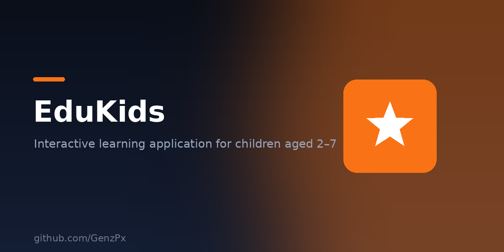

<p align="center">
  
</p>

# 🧒 EduKids

Aplikasi pembelajaran interaktif untuk anak usia **2–7 tahun**. Dibuat dengan HTML, CSS, dan JavaScript murni — ringan, bisa jalan offline, tanpa tracker.

## Fitur

- Pelajaran interaktif berbasis gambar & suara
- Animasi ramah anak
- Konten sesuai usia dini
- Jalan di browser, gak perlu install

## Menjalankan

Buka `index.html` langsung di browser, atau pakai server lokal:

```bash
python3 -m http.server 8080
# lalu buka http://localhost:8080
```

## Struktur

- `index.html` — halaman utama
- `app.js` — logika aplikasi
- `lessons.json` — konten pelajaran
- `assets/` — gambar & suara

## Lisensi

MIT © GenzPx
